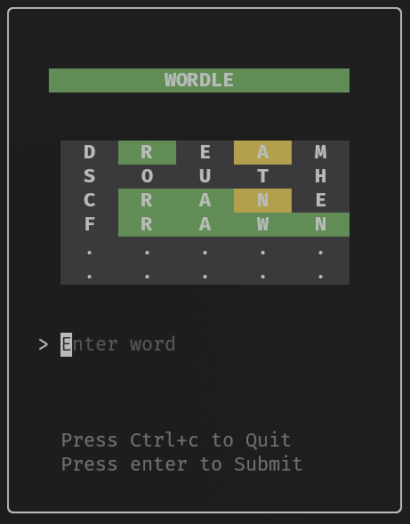

# WORDLE CLI

A stylish, interactive, terminal-based clone of the popular Wordle puzzle game built with **Go** and the **[Charm](https://charm.sh/)** TUI ecosystem.

<p align="center">
  
</p>

---

## ✨ Features

- 🎮 **Classic Wordle Mechanics**: Guess the secret 5-letter word within 6 attempts.
- 🎲 **Random Word Selection**: Each game randomly selects from a curated list of 1,800+ valid 5-letter words.
- 🎨 **Modern Terminal UI**: Beautifully rendered using [Bubble Tea v2](https://github.com/charmbracelet/bubbletea) and [Lip Gloss v2](https://github.com/charmbracelet/lipgloss).
- ⚡ **Instant Visual Feedback**: Clear color-coded feedback highlighting exact matches, misplaced letters, and wrong letters.
- 🛡️ **Input Validation**: Ensures only valid 5-letter alphabetical inputs are accepted.
- 📦 **Self-Contained**: All word lists embedded in the binary - no external files required.
- 🚀 **Cross-Platform**: Compiles to standalone binaries for Linux, macOS, and Windows via GoReleaser.

---

## 🎮 How to Play

1. Run the game in your terminal.
2. Type a **5-letter word** and press <kbd>Enter</kbd> to submit your guess.
3. Check the color of the tiles to guide your next guess:

| Color | Meaning |
| :--- | :--- |
| 🟩 **Green** | The letter is in the word and in the **correct position**. |
| 🟨 **Yellow / Gold** | The letter is in the word but in the **wrong position**. |
| ⬛ **Dark Gray** | The letter is **not in the word** (or duplicate count exceeded). |

4. You have **6 attempts** to find the correct word!

### ⌨️ Keybindings

| Key | Action |
| :--- | :--- |
| <kbd>Enter</kbd> | Submit your current 5-letter guess |
| <kbd>Ctrl</kbd> + <kbd>C</kbd> | Quit the game at any time |
| <kbd>Q</kbd> | Quit the game after the match ends |

---

## 🚀 Installation & Usage

### 📦 Download Pre-built Binary (Recommended)

You do not need Go installed to play! Pre-compiled binaries for **Linux**, **macOS**, and **Windows** are available in the [Releases](https://github.com/tehritarun/wordle_cli/releases) section.

1. Go to the **[Latest Release](https://github.com/tehritarun/wordle_cli/releases/latest)** page.
2. Download the archive matching your OS and architecture (e.g., `wordle_cli_Linux_x86_64.tar.gz`, `wordle_cli_Darwin_arm64.tar.gz`, etc.).
3. Extract and run:

#### Linux / macOS

```bash
# Extract the archive
tar -xzf wordle_cli_*.tar.gz

# (Optional) Move to your PATH for global access
sudo mv wordle_cli /usr/local/bin/

# Start the game
wordle_cli
```

#### Windows

1. Download and extract `wordle_cli_Windows_x86_64.zip`.
2. Open Command Prompt or PowerShell in the extracted folder.
3. Run:
   ```powershell
   .\wordle_cli.exe
   ```

---

### 🛠️ Build from Source

If you prefer to build from source or make modifications, ensure you have [Go](https://go.dev/dl/) (v1.22+) installed:

#### Run Directly

```bash
go run .
```

#### Build Executable

```bash
# Build binary
go build -o wordle_cli .

# Run binary
./wordle_cli
```

#### Install via `go install`

```bash
go install .
```

---

## 📂 Project Structure

```text
wordle_cli/
├── images/
│   └── main_screenshot.png   # Application screenshot
├── .goreleaser.yaml          # Multi-platform release automation configuration
├── go.mod                    # Go module dependencies
├── go.sum                    # Go module checksums
├── LICENSE                   # MIT License
├── main.go                   # Application entry point and program runner
├── wordle.go                 # Game validation logic and color matcher
├── wordle_ui.go              # Bubble Tea model, update loops, and Lip Gloss views
├── words.go                  # Embedded word list (1,800+ valid 5-letter words)
└── README.md                 # Project documentation
```

---

## 🛠️ Built With

- **[Go](https://go.dev/)** – Programming language
- **[Bubble Tea v2](https://github.com/charmbracelet/bubbletea)** – The fun, functional, and stateful TUI framework
- **[Lip Gloss v2](https://github.com/charmbracelet/lipgloss)** – Style definitions, layout primitives, and color formatting
- **[Bubbles v2](https://github.com/charmbracelet/bubbles)** – Reusable TUI components (Text Input)
- **[GoReleaser](https://goreleaser.com/)** – Release automation and cross-compilation

---

## 📄 License

This project is licensed under the MIT License - see the [LICENSE](LICENSE) file for details.
